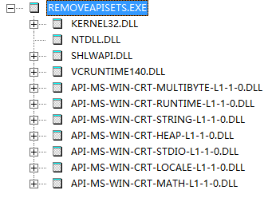
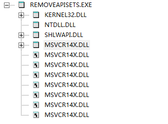

# RemoveApiSets
RemoveApiSets is a program that can replace the ApiSets Dlls that already depend on ApiSets Dlls with MSVCR14X Dlls

## prior project:
https://github.com/sonyps5201314/ntdll.git

https://github.com/sonyps5201314/msvcr14x.git

## build steps:
1.git clone https://github.com/sonyps5201314/RemoveApiSets

2.build with vs

## use:
RemoveApiSets.exe <exe/dll file or fold that contains all exe/dll files you need to be converted.>
or run RemoveApiSets.exe with no parameters,and then dragdrop the dst file or directory to the console window.

## tip:
the 32bit RemoveApiSets.exe can only convert the 32bit executable files, and 64bit RemoveApiSets.exe can only convert the 64bit executable files.

## compare images:
Before      After

## LEGAL STATEMENT:
Modification of copyrighted executables may be subject to legal risks. Please do not use this software for illegal activities.

## refer to:
https://github.com/lucasg/Dependencies.git
